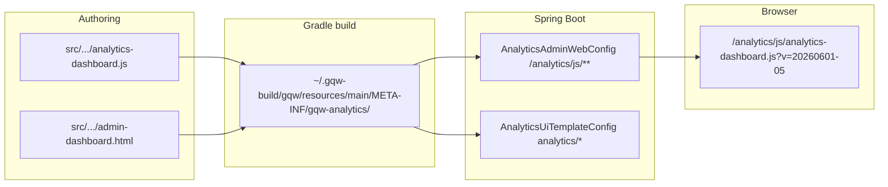
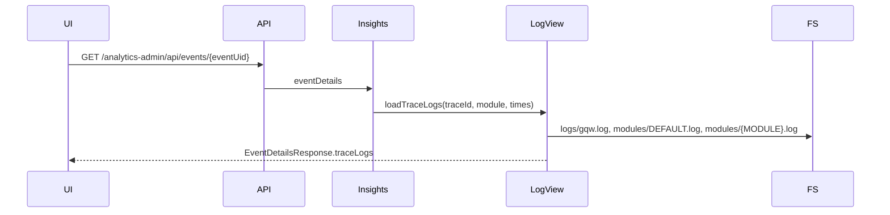

# Карта архитектуры Analytics Admin (read-only)

**Источник истины:** [`src/main/resources/META-INF/gqw-analytics/`](src/main/resources/META-INF/gqw-analytics/) + Java в [`src/main/java/com/example/gqw/analytics/`](src/main/java/com/example/gqw/analytics/).  
**Runtime classpath:** Gradle копирует resources в `%USERPROFILE%\.gqw-build\gqw\resources\main\` ([`build.gradle`](build.gradle) строка 15). Браузер получает файлы из **classpath**, не напрямую из `src/`.



---

## 1. Карта файлов проекта

### Backend (Java/Spring)

| Зона | Путь | Назначение |
|------|------|------------|
| Точка входа | [`GqwApplication.java`](src/main/java/com/example/gqw/GqwApplication.java) | Spring Boot app |
| Analytics пакет | `com.example.gqw.analytics.*` (~115 файлов) | Вся аналитика |
| Admin MVC | [`AnalyticsAdminController.java`](src/main/java/com/example/gqw/analytics/controller/AnalyticsAdminController.java) | `/analytics-admin/*`, dashboard → `analytics/admin-dashboard` |
| REST API | `*Controller` с двойным mapping `/analytics/api` **и** `/analytics-admin/api` | Данные для JS |
| Web config | [`AnalyticsAdminWebConfig.java`](src/main/java/com/example/gqw/analytics/config/AnalyticsAdminWebConfig.java) | Static `/analytics/js|css|img/**` |
| Templates | [`AnalyticsUiTemplateConfig.java`](src/main/java/com/example/gqw/analytics/config/AnalyticsUiTemplateConfig.java) | Thymeleaf prefix `classpath:/META-INF/gqw-analytics/templates/` |
| Auth | [`AnalyticsAdminAuthInterceptor.java`](src/main/java/com/example/gqw/analytics/config/AnalyticsAdminAuthInterceptor.java) | Session для admin |
| DTO (API) | [`AnalyticsApiDto.java`](src/main/java/com/example/gqw/analytics/web/dto/AnalyticsApiDto.java) | Records для REST |
| Legacy DTO | `analytics/service/dto/*` | Старый слой, частично дублирует API |
| Config | [`application.properties`](src/main/resources/application.properties) | DB, logging, rollup cron |
| Logback | [`logback-spring.xml`](src/main/resources/logback-spring.xml) | Ротация `logs/gqw.log` + module logs |

### Frontend (Analytics Admin)

| Путь | Назначение |
|------|------------|
| [`admin-dashboard.html`](src/main/resources/META-INF/gqw-analytics/templates/analytics/admin-dashboard.html) | Главная страница Analytics Admin |
| [`dashboard.html`](src/main/resources/META-INF/gqw-analytics/templates/analytics/dashboard.html) | Встроенная аналитика в shop admin (`/analytics`) |
| [`analytics-dashboard.js`](src/main/resources/META-INF/gqw-analytics/static/js/analytics-dashboard.js) | ~10.8k строк: фильтры, графики, compare, loaders |
| [`analytics-settings.js`](src/main/resources/META-INF/gqw-analytics/static/js/analytics-settings.js) | Runtime settings modal (только admin) |
| [`app.css`](src/main/resources/META-INF/gqw-analytics/static/css/app.css) | Стили analytics UI |

### Где лежит Analytics Admin

- URL: **`http://localhost:8080/analytics-admin/dashboard`** (после login/setup)
- API base в JS: `/analytics-admin/api` (определяется по `pathname` в [`analytics-dashboard.js`](src/main/resources/META-INF/gqw-analytics/static/js/analytics-dashboard.js) строки 2–5)
- Shop-вариант: `/analytics` + `ROLE_ADMIN`, тот же JS, API `/analytics/api`

### Runtime / build директории

| Путь | Роль |
|------|------|
| **`%USERPROFILE%\.gqw-build\gqw\`** | Реальный `buildDirectory` Gradle (из-за кириллицы в пути проекта) |
| `~/.gqw-build/gqw/resources/main/META-INF/gqw-analytics/` | То, что попадает в JAR/classpath при `bootRun` |
| [`bin/main/META-INF/gqw-analytics/`](bin/main/META-INF/gqw-analytics/) | IDE-копия (может отставать от `src` и от `.gqw-build`) |
| `logs/analytics/modules/*.log` | Runtime module logs (не в classpath) |

**Какой `analytics-dashboard.js` грузит браузер:**  
`GET /analytics/js/analytics-dashboard.js?v=20260601-05` → classpath `META-INF/gqw-analytics/static/js/analytics-dashboard.js` (из `.gqw-build` после compile). **Не** из `src/` напрямую.

Подключение в [`admin-dashboard.html`](src/main/resources/META-INF/gqw-analytics/templates/analytics/admin-dashboard.html):

```html
<link th:href="@{/analytics/css/app.css(v='20260601-01')}">
<script th:src="@{/analytics/js/analytics-dashboard.js(v='20260601-05')}"></script>
<script th:src="@{/analytics/js/analytics-settings.js(v='20260601-03')}"></script>
```

---

## 2. Ключевые файлы → ответственность

```text
admin-dashboard.html          -> разметка вкладок, главный фильтр, canvas, KPI cards
dashboard.html                -> shop-вариант (без analytics-settings.js)
analytics-dashboard.js        -> вся клиентская логика дашборда
analytics-settings.js         -> runtime settings / diagnostics / backfill
app.css                       -> layout, loaders, compare-pair, KPI scroll
AnalyticsAdminController      -> MVC routes, session auth, view model analyticsApiBase
AnalyticsAdminWebConfig       -> resource handlers /analytics/js|css|img
AnalyticsUiTemplateConfig     -> Thymeleaf resolver для analytics/*
AnalyticsOverviewController   -> GET /overview, /overview/compare
AnalyticsStageController      -> GET /stages, /stages/compare, /stage-metrics, /stage-metrics/compare
AnalyticsUniversalController  -> GET /universal, /universal/compare
AnalyticsCompareController    -> GET /compare (вкладка Сравнение)
AnalyticsEventController      -> GET /events, /events/{uid} (+ traceLogs в details)
AnalyticsFilterOptionsController -> справочники filter-options
AnalyticsDictionaryController -> справочники modules/eventTypes/attributes
AnalyticsInsightsService      -> агрегация overview/stages/universal/event details
AnalyticsLogViewService         -> чтение trace строк из log-файлов
AnalyticsApiDto               -> контракт REST для frontend
```

---

## 3. Главный фильтр

### UI (HTML)

Плавающая панель `#analytics-main-form` в [`admin-dashboard.html`](src/main/resources/META-INF/gqw-analytics/templates/analytics/admin-dashboard.html):

| Поле | DOM id | Хранение |
|------|--------|----------|
| Период | `analytics-from`, `analytics-to` | DOM → `mainParams()` |
| Bucket | `analytics-bucket` | DOM → `bucketMinutes` |
| Быстрый пресет | `analytics-quick-preset-select`, range N/unit | JS helpers |
| Модуль | `analytics-module-type` | DOM → `moduleCode` |
| Тип события | `analytics-event-type` | DOM → `eventTypeCode` |
| Общий сценарий | `analytics-analysis-scenario` | DOM + `state.chartScenarioBySource` (глобальный селект) |
| Режим сравнения | radios `analytics-global-compare-mode-{off\|split\|overlay}` | `state.globalCompareMode` |
| Разрез сравнения | `analytics-global-compare-preset` | `state.globalComparePreset` → before-period |
| Период «до» | `analytics-global-before-from/to` | `resolveGlobalBeforeRange()` |
| Атрибут | `analytics-global-attr-*` | `mainParams()` filterAttribute* |

### Apply / Reset

- **Apply:** `submitMainFilters` → `runMainFiltersOnce` ([`analytics-dashboard.js`](src/main/resources/META-INF/gqw-analytics/static/js/analytics-dashboard.js) ~694–717)
  - Сбрасывает expanded ranges, синхронизирует дочерние панели (stage metrics, events, universal)
  - `reloadAll()` → `loadOverview` + `loadStages`
  - Если `state.globalCompareEnabled` → `applyGlobalCompareToAllCharts()`
- **Reset:** `#analytics-floating-reset` (bindEvents) — сброс к дефолтам + повторный submit

### Правило «главный → все графики»

Реализовано через:

1. `mainParams()` — общие query-параметры для overview/stages/events
2. `applyGlobalCompareToAllCharts()` — проталкивает mode/preset/ranges в `INLINE_COMPARE_CHART_IDS`
3. `sync*FromMain()` — копирует период в локальные панели (metrics, raw, universal)
4. `UNIVERSAL_COMPARE_FOLLOWS_GLOBAL = true` — universal следует глобальному compare

**Локальный фильтр графика не меняет главный:** per-chart controls (`data-inline-compare-mode`, expanded filters, `state.inlineCompareModeOverriddenBySource`) пишут только в `state.*BySource`, не в DOM главного фильтра.

### Где может ломаться

- `refs.globalCompareEnabled = getElementById("analytics-global-compare-enabled")` — **элемента в HTML нет** (остался только от старого checkbox API); рабочий флаг — `state.globalCompareEnabled` из `setGlobalCompareMode()`
- При `globalCompareEnabled` `reloadAll()` **не** фоново обновляет universal/metrics/events (~1745) — ожидается `applyGlobalCompareToAllCharts()`; если compare off, но вкладка metrics уже в До/после — рассинхрон
- `isChartCompareEnabled()` имеет сложный fallback (`globalEnabled && globalApplicable`) — KPI может считаться в compare при несогласованности `inlineCompareEnabled` vs `resolveInlineCompareMode`

---

## 4. Compare modes (off / split / overlay)

### State model

```javascript
state.globalCompareMode          // "off" | "split" | "overlay"
state.globalCompareEnabled       // mode !== "off"
state.inlineCompareModeBySource  // per chart
state.inlineCompareModeOverriddenBySource
state.inlineCompareEnabled       // legacy boolean: true только при split layout
state.inlineCompareGhostBySource // true при overlay
state.inlineComparePresetBySource
state.expandedRangesBySource     // beforeFrom/To, afterFrom/To per chart
```

### Resolver chain

```text
resolveGlobalCompareModeFromUi()     // читает radios
setGlobalCompareMode(mode)           // globalCompareMode + globalCompareEnabled
resolveGlobalInlineCompareMode()     // global mode или fallback "split" если enabled без mode
resolveInlineCompareMode(canvasId)   // override local OR inherit global
resolveChartCompareMode(canvasId)    // для canvas + compare-inline ids
isChartSplitCompare / isChartOverlayCompare / isChartCompareEnabled
```

### applyInlineCompareMode (~6853)

- `split` → `inlineCompareEnabled[canvas]=true`, `enableInlineCompareLayout`
- `overlay` → `inlineCompareEnabled=false`, `inlineCompareGhostBySource=true`
- `off` → disable layout

### Before-period

- Нет `beforePeriod`; используются **`beforeFrom` / `beforeTo`**
- Глобально: `resolveGlobalBeforeRange()` + preset `analytics-global-compare-preset` («Разрез сравнения»)
- Per-chart: `resolveInlineCompareRequestRanges(canvasId)` + `state.expandedRangesBySource`

### Старые boolean-флаги (ещё живые)

| Флаг / UI | Где |
|-----------|-----|
| `state.inlineCompareEnabled` | split layout on/off; `toggleInlineCompareChart` |
| `state.globalCompareEnabled` | синхрон с mode, но отдельное поле |
| `refs.globalCompareEnabled` | **мертвая ссылка** на несуществующий checkbox |
| `#stage-metric-compare-enabled` | вкладка **Метрики** — отдельный «До/после» |
| `#stage-text-compare-enabled` (если есть) | текстовые метрики |
| `#universal-compare-enabled` hidden | universal tab |
| `toggleInlineCompareChart` | старый toggle path параллельно mode dropdown |

### Поддержка off/split/overlay по зонам

| Зона | off | split | overlay |
|------|-----|-------|---------|
| Overview inline charts (5) | да | да | да (ghost datasets) |
| chart-event-kpi mini | да | **не side-by-side** (special case) | да (dual series on one canvas) |
| chart-event-kpi expanded | да | да | да |
| Universal (3 charts) | да | частично | `universalCompareGhost` |
| Metrics stage-metric | через **отдельный checkbox** | 2 колонки До/После | нет unified mode |
| Compare tab | свой UI (baseline/target) | N/A | N/A |

### Где global mode не доходит

- Вкладка **Сравнение** — независимые `compareBaselineFrom/To`, `compareTargetFrom/To`
- **Metrics** — `stage-metric-compare-enabled`, не три режима overlay
- **Raw events** — только период/фильтры, без overlay
- KPI mini **split** глобально может включить `inlineCompareEnabled`, но `enableInlineCompareLayout("chart-event-kpi")` **не** строит пару панелей (~6904–6917)

---

## 5. Матрица графиков по вкладкам

### Обзор (`overview`)

| График | canvasId | API | JS render | off | split | overlay | expand | лок. фильтры | сценарии |
|--------|----------|-----|-----------|-----|-------|---------|--------|--------------|----------|
| Поток событий | `chart-events-count` | `GET /overview` (+ 2-й запрос before) | `loadOverview` → `upsertChart` | да | да | ghost line | да | expanded event filter | `CHART_SCENARIOS` |
| Latency trend | `chart-latency` |同上 |同上 | да | да | да | да | да | да |
| Error rate | `chart-error-rate` |同上 |同上 | да | да | да | да | да | да |
| KPI по типам | `chart-event-kpi` (+ `chart-event-kpi-compare-inline`) | `/overview` eventBreakdown | `loadOverview` KPI block ~3209 | да | expanded only; mini NO split pair | да mini | да | нет | да |
| Этапы latency | `chart-stage-latency` | `GET /stages` | `loadStages` | да | да | да | да | да | да |
| Этапы errors | `chart-stage-errors` | `GET /stages` | `loadStages` | да | да | да | да | да | да |
| KPI cards | `kpi-total-events`, `kpi-avg-ms`, … | `/overview` summary | `loadOverview` render KPI | — | — | — | нет | нет | help only |
| Таблица этапов | `analytics-stage-table` | `/stages` table | `loadStages` | — | — | — | нет | нет | help |

### Универсальный анализ (`universal`)

| График | canvasId | API | JS | off/split/overlay | expand | лок. фильтры |
|--------|----------|-----|-----|-------------------|--------|--------------|
| Timeline | `chart-universal-timeline` | `/universal`, `/universal/compare` | `loadUniversal` | follows global + local | да | universal panel filters |
| Stages | `chart-universal-stages` |同上 |同上 |同上 | да | да |
| Event KPI | `chart-universal-event-kpi` |同上 |同上 |同上 | **NO** (`NO_EXPAND`) | да |

### Raw (`raw`)

| Элемент | id | API | JS |
|---------|-----|-----|-----|
| Таблица событий | `analytics-events-table` | `GET /events` | `loadEvents` |
| Модалка события | modal | `GET /events/{eventUid}` | `openEventDetails` → `traceLogs` |

### Метрики (`metrics`)

| График | canvasId | API | JS | compare |
|--------|----------|-----|-----|---------|
| Числовые series | `chart-stage-metric-series` | `/stage-metrics`, `/stage-metrics/compare` | `loadStageMetrics` | checkbox **До/после** → split cols |
| Compare canvas | `chart-stage-metric-series-compare` |同上 | `loadStageMetricComparisonSeries` | только при checkbox |
| Текстовые | `chart-stage-metric-text` | stage-metrics summaries | `loadStageMetricTextCharts` | checkbox split |
| Compare text | `chart-stage-metric-text-compare` |同上 |同上 | checkbox |

### Сравнение (`compare`)

| Элемент | id | API | JS |
|---------|-----|-----|-----|
| KPI cards | `compareCards` container | `GET /compare` | `loadCompare` → `renderCompareCards` |
| Delta chart | `chart-compare-delta` | `/compare` delta | `loadCompare` → `upsertChart` |

---

## 6. KPI по типам событий (особая логика)

**Построение:** `buildEventKpiRows(eventBreakdown)` ← `OverviewResponse.eventBreakdown` в `loadOverview`.

| Режим | Условие | Поведение |
|-------|---------|-----------|
| Mini off | `!isChartCompareEnabled("chart-event-kpi")` | один график, все `currentRows`, `renderMode: mini-single-full` |
| Mini overlay | compare on, не split layout | `buildEventKpiCompareOverlayRows` — union labels, До/После series на **одном** canvas + baseline на `chart-event-kpi-compare-inline` |
| Mini split | глобальный split может выставить `inlineCompareEnabled`, но layout **не** создаёт пару wrap (~6904) — **фактически не использовать** |
| Expanded | `toggleExpandedChart` / `renderExpandedChartClone` | off/split/overlay из `resolveInlineCompareMode`; split → два scroll host |

**Top-10:** `prepareEventKpiMiniTopNConfig` определена (~10546), **нигде не вызывается**; `topNApplied = false` hardcoded (~5952); hint — «все события + horizontal scroll».

**Horizontal scroll:** `ensureKpiMiniWrap`, `applyKpiDynamicWidth`, `queueInitialKpiCompareScrollOffsets` (~6% scrollLeft).

**X/Y zoom expanded:** `setupExpandedZoomControls`, `DEBUG_KPI_EXPANDED_X_ZOOM`.

**Category width:** через dynamic width по числу labels в `applyKpiDynamicWidth`.

---

## 7. Сценарии анализа (не трогать в ближайших фиксах)

- **Общий:** `#analytics-analysis-scenario` + help `#analytics-analysis-scenario-help`
- **Персональные:** `CHART_SCENARIOS_BY_CANVAS` (~163–460), UI `ensureChartScenarioPicker` в `initChartExpandUi`
- Связь с фильтрами: сценарии **описательные** (label/description/details); не меняют API автоматически — пользователь вручную сужает фильтры по подсказкам
- Кнопки/иконки сценариев уже в DOM — отдельная будущая задача на функциональность

---

## 8. Loader lifecycle

| Тип | Функция | Текст | Когда |
|-----|---------|-------|-------|
| Global | `setGlobalScreenLoading` | «Применяем фильтр...» | `reloadAll()` |
| Panel | `setPanelLoading` | то же | stage metrics, universal submit |
| Chart | `setChartActionLoading` | panel + expanded | compare toggle/mode, `applyGlobalCompareToAllCharts` |
| Expanded | `setExpandedChartLoading` | то же | expand refresh |

**Правильная модель (как в коде задумано):**

```text
Главный фильтр → setGlobalScreenLoading + reloadAll (+ applyGlobalCompare)
Локальный график → setChartActionLoading(canvasId) only
Ошибка → Promise.allSettled / try-finally → loader снимается; showDashboardDataStatus
```

**Риски зависания:**

- `globalLoadingDepth` / `panelLoadingDepth` ref-count — при исключении без `finally` (большинство путей покрыты)
- `applyGlobalCompareToAllCharts` ставит loader на все inline charts, но secondary tasks async
- Background `runPanelBackgroundRefresh` при compare on **отключён** — панель может показать stale без loader
- `toggleInlineCompareChart` + expand recreate — двойной loader path

---

## 9. Кодировки / mojibake

| Проверка | Результат |
|----------|-----------|
| Grep `Рџ|Р’|РЎ|СЃ` в js/html/java | **не найдено** в актуальных файлах |
| Русский в JS | Unicode escapes (`\u0412\u044b\u043a\u043b...`) или UTF-8 строки |
| Backup | `analytics-dashboard.js.bak_mojibake_fix` — след прошлого инцидента |
| Gradle compile | `options.encoding = 'UTF-8'`, JVM `-Dfile.encoding=UTF-8` |
| Logging | `logging.charset.*=UTF-8` |
| Справочники Модуль/Тип/Атрибут | API `/dictionaries`, `/filter-options` из PostgreSQL |
| Thymeleaf | `UTF-8` в resolver |

**Источники риска:** редактор без UTF-8, копипаст в HTML, DB legacy data; API/БД — проверять отдельно при багрепортах UI.

---

## 10. Модалка «Логи (trace)»



- **Endpoint:** только внутри `GET .../events/{eventUid}` — отдельного trace API нет
- **Reader:** [`AnalyticsLogViewService`](src/main/java/com/example/gqw/analytics/service/AnalyticsLogViewService.java) — читает **только активные** файлы, **не** `archive/*.gz`
- **Фильтр:** `[trace:...]`, окно event ±180s/+240s
- **Ротация:** logback 20MB, 30 days → `logs/analytics/modules/archive/{MODULE}.date.i.log.gz`

**Почему старые события без логов:** архивные `.gz` не сканируются; trace мог быть в другом module file; логи могли ротироваться/удалиться.

**Варианты решения (диагностика, не реализация):**

1. Читать active + archive по дате события  
2. Normalized trace store в БД  
3. Индекс traceId → file offset  

---

## 11. Static resources — чеклист для frontend-правок

1. Править **`src/main/resources/META-INF/gqw-analytics/...`** (не `bin/main` вручную)
2. `.\gradlew.bat compileJava` или `bootRun` — копия в `~/.gqw-build/gqw/resources/main/`
3. Bump `v='YYYYMMDD-NN'` в [`admin-dashboard.html`](src/main/resources/META-INF/gqw-analytics/templates/analytics/admin-dashboard.html) для JS **и** CSS при необходимости
4. Hard refresh / DevTools disable cache
5. Проверка актуальности: DevTools → Network → `analytics-dashboard.js?v=...` → Response содержит маркер `ANALYTICS_DASHBOARD_DEBUG_VERSION` или недавнее изменение
6. `window.__analyticsDebug` в консоли (если экспортирован)
7. Не путать shop `dashboard.html` и admin `admin-dashboard.html` (разные cache-buster контексты)
8. DevTools LiveReload может подхватывать `.gqw-build` — при странном поведении — clean build

---

## 12. Порты и процессы

| Действие | Команда |
|----------|---------|
| Compile | `.\gradlew.bat compileJava` |
| Run | `.\gradlew.bat bootRun` (зависит от `freePort8080` — убивает слушатель 8080 на Windows) |
| Port | **8080** (default, `server.port` не задан) |
| Check port | `netstat -ano \| findstr :8080` или `Get-NetTCPConnection -LocalPort 8080` |
| Stop Gradle daemons | `.\gradlew.bat --stop` |
| JDK | 21 (toolchain в build.gradle) |
| DB | PostgreSQL `localhost:5432/gqw` |

---

## 13. Проблемы, видимые по коду

1. **Мёртвая ссылка** `analytics-global-compare-enabled` в JS при radios-only HTML  
2. **Два параллельных API compare:** mode-based (overview) vs checkbox (metrics) vs отдельная вкладка `/compare`  
3. **KPI mini split** — несоответствие product rules и `inlineCompareEnabled`  
4. **Trace logs** — нет чтения archives → пусто для старых событий  
5. **Тройной источник static:** src / `.gqw-build` / `bin/main` — риск «правил, но не видно»  
6. **`prepareEventKpiMiniTopNConfig` dead code** — путаница при отладке Top-10  
7. **`isChartCompareEnabled` fallback** — возможные ложные compare states для KPI  
8. **reloadAll skips background panels** when global compare on — stale universal/metrics until `applyGlobalCompare` completes  
9. **`toggleInlineCompareChart`** — legacy boolean path рядом с `applyInlineCompareMode`  

---

## 14. Рекомендованный порядок следующих фиксов

1. **Runtime/static sanity** — verify `.gqw-build` sync + cache buster workflow (без логики)  
2. **Compare state unification** — убрать мёртвые refs, согласовать KPI mini с off/overlay-only  
3. **Loader correctness** — главный vs локальный, finally на всех async paths, metrics/universal при global compare  
4. **Global → metrics bridge** — решить: metrics следуют global mode или остаются отдельным checkbox  
5. **Trace logs** — archive-aware read (минимальный fix) или DB index (стратегический)  
6. **Encoding audit** — только при воспроизведении бага (файл vs API vs DB)  
7. **Scenarios functionality** — отдельный эпик после стабилизации compare/loaders  

---

```text
Код не менял.
Порт 8080 не занимал / не освобождал.
```
